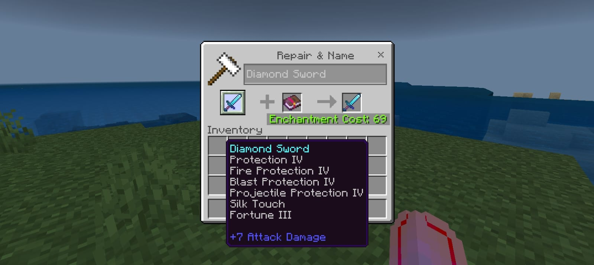

# ✨ LimitlessGlint

A fun mod that allows you to put any enchantments on any enchantable item.

> [!WARNING]  
> ⚠️ **Not meant for survival gameplay.**

---

---

## ⚙️ Requirements

- 🚀 [LeviLauncher](https://github.com/LiteLDev/LeviLaunchroid)

## 🛠️ Installation

- Install LeviLauncher
- Import LimitlessGlint mod in LeviLauncher by doing "Manage Mods > Add Mod"
- Launch Minecraft with the mod activated

## 📜 License
- This project is licensed under the GNU LGPL v3.0.
- It also uses the GlossHook library licensed under the MIT License.
- See the NOTICE file for details.
